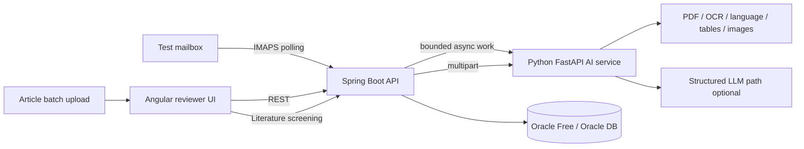

# Clinevo Smart Inbox Assistant

Production-oriented candidate implementation of the **Clinevo Technologies Smart Inbox Assistant** assignment.

The application reads an isolated test mailbox, processes PDF attachments, classifies each message into one or more of **ICSR / Safety Report**, **PQC / Quality Complaint**, **MI / Medical Information Request**, or **Not Relevant**, extracts structured facts with field-level confidence and source provenance, and presents the result to a human reviewer for acceptance or correction.

> **Synthetic data only.** This repository must never contain real patient, reporter, client, or production mailbox data.

## Architecture



The implementation follows the requested stack: **Angular → Spring Boot → Python AI service → Oracle**. Docker Compose runs the complete local stack.

## Assignment coverage

| Requirement | Implementation |
| --- | --- |
| Real test mailbox intake | IMAP/IMAPS scheduled polling with environment-only credentials |
| Sender, subject, date, body | Parsed and persisted in Oracle |
| PDF attachments | Processed; unsupported attachment types are logged |
| Digital PDFs | Direct text extraction |
| Scanned / handwritten PDFs | Tesseract OCR path with OCR confidence |
| Published articles | Article detection, reference stripping, case-oriented screening |
| Non-English PDFs | Language detection with Spanish/French deterministic fallback; optional LLM normalization |
| Tables | `pdfplumber` structured rows/columns |
| Meaningful images | Embedded-image detection, description, human-review flag |
| 10–15 sentence PDF summary | Reviewer-oriented summary generated by the document service |
| Multi-label classification | ICSR, PQC, MI, Not Relevant with confidence and reason |
| Safety extraction | Patient, reporter, product, reaction, severity and narrative-oriented facts |
| PQC extraction | Product/batch/lot, issue and photo indicator |
| MI extraction | Question and product/topic |
| No guessing | Missing fields remain `Not stated`, confidence `0.0`, no source |
| Auditability | Source type/name/page/evidence/confidence + reviewer action log |
| Human review | Angular accept/override workflow with editable facts |
| Batch performance | Synthetic corpus runner records client/service milliseconds |
| Optional literature bonus | Independent article-PDF batch upload, multi-case split, relevance reason and summary |

## Quick start — full stack

### Prerequisites

- Docker Engine / Docker Desktop with Docker Compose v2
- About 6 GB free RAM for the full local stack; Oracle Free is the largest container
- A synthetic/test mailbox only if you want to demonstrate live email ingestion

### 1. Configure environment

```bash
cp .env.example .env
```

Replace the local Oracle passwords and, if desired, configure a test mailbox. Do **not** commit `.env`.

### 2. Start everything

```bash
docker compose up --build
```

Services:

- Reviewer UI: `http://localhost:4200`
- Spring Boot API: `http://localhost:8080`
- Backend health: `http://localhost:8080/actuator/health`
- Python AI service: `http://localhost:8000`
- AI health: `http://localhost:8000/health`
- Oracle listener: `localhost:1521`, service `FREEPDB1`

Flyway creates the application schema automatically.

### 3. Generate the synthetic corpus

```bash
python -m venv .venv
source .venv/bin/activate        # Windows: .venv\Scripts\activate
pip install -r samples/requirements.txt
python samples/scripts/generate_corpus.py
```

### 4. Run the required batch and capture timings

```bash
python samples/scripts/run_batch.py --url http://localhost:8000
```

Actual JSON outputs, `batch_report.csv`, and `summary.json` are written to `samples/outputs/`. These files reflect the exact model/configuration used for the walkthrough.

## Test mailbox demonstration

Configure these variables in `.env`:

```text
MAIL_HOST=...
MAIL_PORT=993
MAIL_USERNAME=...
MAIL_PASSWORD=...
MAIL_FOLDER=INBOX
MAIL_SSL=true
```

The backend polls unread messages, de-duplicates by `Message-ID`, stores message metadata/body, captures attachments, dispatches PDF processing asynchronously, stores AI results and marks the message ready for human review.

To send generated fixtures to an isolated SMTP test account:

```bash
python samples/scripts/send_samples.py \
  --host smtp.example.test --port 587 --starttls \
  --username "$SMTP_USER" --password "$SMTP_PASSWORD" \
  --to "$TEST_MAILBOX"
```

## AI modes

### Deterministic/offline mode — default

If `LLM_API_URL` and `LLM_MODEL` are empty, the service uses deterministic extraction/classification rules. This makes CI, offline demonstrations, and regression tests repeatable.

### Structured LLM mode — optional

Configure:

```text
LLM_API_URL=https://your-provider.example/v1/chat/completions
LLM_MODEL=your-model
LLM_API_KEY=...
LLM_TIMEOUT_SECONDS=45
```

The LLM is required to return validated structured JSON. The service validates the response with Pydantic and validates cited evidence/page provenance against the actual source. Unsupported LLM facts are discarded rather than trusted blindly.

The prompt contract is in `ai-service/prompts/classify_extract.md`.

## Literature screening bonus

The reviewer UI includes an independent article-PDF uploader. A batch can contain up to 25 synthetic PDFs. Numbered `Case`/`Patient` sections are split, each case is screened independently against the minimum ICSR elements, and each result includes:

- reportable-candidate decision
- confidence
- relevance reason
- summary
- classifications
- extracted facts when reportable
- original PDF page provenance

API route: `POST /api/literature/screen`.

## API overview

| Method | Path | Purpose |
| --- | --- | --- |
| GET | `/actuator/health` | production health endpoint |
| GET | `/api/health` | lightweight application health |
| GET | `/api/inbox` | reviewer queue |
| GET | `/api/inbox/{id}/detail` | classifications, attachments, facts, audit history |
| POST | `/api/inbox/{id}/review` | accept/override reviewer decision |
| POST | `/api/inbox/{id}/process` | manually queue an item |
| POST | `/api/literature/screen` | independent literature batch screening |
| GET | `AI /health` | AI service health |
| POST | `AI /process` | document processing |
| POST | `AI /literature/screen` | article batch screening |

When `CLINEVO_API_KEY` is set, mutation requests require `X-API-Key`. This is deliberately lightweight for the candidate prototype; production replacement is OIDC/OAuth2 with RBAC.

## Tests and CI

GitHub Actions runs three independent jobs on every PR:

```bash
# Python AI service
cd ai-service
pip install -r requirements.txt
pytest -q tests

# Spring Boot
cd backend
mvn -B test

# Angular
cd frontend
npm install
npm run build
npm test -- --no-progress
```

The test suite covers classification rules, negation, missing facts, page provenance, LLM evidence validation, literature case splitting, API validation, reviewer persistence and API-key behavior.

## Data model and auditability

Oracle stores messages, attachments, classifications, extracted facts, reviewer actions and audit events. Extracted fields persist:

- source type (`EMAIL` / `PDF`)
- source name or attachment name
- PDF page where applicable
- supporting evidence text
- field-level confidence

Reviewer corrections never silently overwrite AI history; reviewer actions are timestamped separately.

## Security and data handling

Current safeguards include environment-only secrets, no committed API keys, synthetic-only fixtures, input-size limits, API mutation guard, IMAP timeouts, SHA-256 attachment fingerprints, duplicate-message protection, structured error responses, health probes, graceful shutdown and non-root application containers where practical.

A cloud LLM can introduce retention/residency/compliance risk. For a real pharmacovigilance deployment the provider must be contractually approved, data retention must be disabled or controlled, regional processing requirements must be met, and appropriate healthcare/privacy agreements must be in place.

## Known prototype limitations

The assignment asks for a working prototype, not a validated pharmacovigilance product. Important limitations are documented rather than hidden:

- deterministic classification is intentionally conservative and cannot replace a domain-trained safety model
- local Tesseract is weaker on difficult handwriting than a dedicated vision model
- embedded images are detected and flagged but deep clinical/image interpretation is intentionally not attempted
- API-key authentication is suitable only for an isolated demo
- the current processing queue is bounded but process-local; a production deployment should use a durable broker / DB-backed job queue with retries and DLQ semantics
- production should store immutable originals in approved encrypted object storage and apply retention/legal-hold rules
- production needs OIDC/RBAC, centralized secrets, TLS/mTLS, malware scanning, DLP controls, SIEM integration, distributed tracing, SLOs and validated backup/restore procedures

See `docs/WRITEUP.md` and `docs/ARCHITECTURE.md` for trade-offs and the production evolution plan.

## Submission artifacts

- Architecture: `docs/ARCHITECTURE.md`
- 2–5 page technical write-up: `docs/WRITEUP.md`
- Testing / batch evidence: `docs/TESTING.md`
- Live walkthrough: `docs/DEMO_WALKTHROUGH.md`
- Screenshot / recording checklist: `docs/SUBMISSION_CHECKLIST.md`
- Representative JSON: `docs/sample-output.json`
- Synthetic corpus: `samples/`

## Repository policy

Development is tracked through GitHub issues and feature branches. Changes are merged to `main` through pull requests after CI passes.
