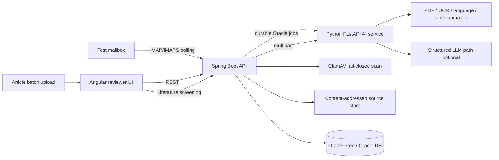

# Clinevo Smart Inbox Assistant

Production-oriented candidate implementation of the **Clinevo Technologies Smart Inbox Assistant** assignment.

The application reads an isolated test mailbox, processes PDF attachments, classifies each message into one or more of **ICSR / Safety Report**, **PQC / Quality Complaint**, **MI / Medical Information Request**, or **Not Relevant**, extracts structured facts with field-level confidence and source provenance, and presents the result to a human reviewer for acceptance or correction.

> **Synthetic data only.** This repository must never contain real patient, reporter, client, or production mailbox data.

## Architecture



The implementation follows the requested stack: **Angular → Spring Boot → Python AI service → Oracle**. Docker Compose runs the complete local stack. The candidate stack also includes ClamAV, immutable/content-addressed source-document storage, durable database-backed processing jobs, and an isolated GreenMail service for end-to-end smoke validation.

## Assignment coverage

| Requirement | Implementation |
| --- | --- |
| Real test mailbox intake | IMAP/IMAPS scheduled polling with environment-only credentials; GreenMail end-to-end CI path |
| Sender, subject, date, body | Parsed and persisted in Oracle |
| PDF attachments | Staged, SHA-256 fingerprinted, malware-scanned before AI, then processed; unsupported attachment types remain logged/queryable |
| Digital PDFs | Direct text extraction |
| Scanned / handwritten PDFs | Tesseract OCR path with OCR confidence |
| Published articles | Article detection, reference stripping, case-oriented screening |
| Non-English PDFs | Language detection; original page text preserved; explicit translation status/method/rationale; bounded Spanish/French synthetic-rule translation offline; optional structured-LLM translation; human verification flag |
| Tables | `pdfplumber` structured rows/columns, persisted with the attachment and exposed in reviewer detail |
| Meaningful images | Real embedded-image extraction; OCR-derived description/evidence when readable; otherwise metadata-only description with no inferred meaning; human visual-review flag |
| 10–15 sentence PDF summary | Reviewer-oriented summary generated by the document service |
| Multi-label classification | ICSR, PQC, MI, Not Relevant with confidence and reason |
| Safety extraction | Patient, reporter, product, reaction, severity and narrative-oriented facts |
| PQC extraction | Product/batch/lot, issue and photo indicator |
| MI extraction | Question and product/topic |
| No guessing | Missing fields remain `Not stated`, confidence `0.0`, no source |
| Auditability | Source type/name/page/evidence/confidence + timestamped processing/reviewer audit events |
| Human review | Angular accept/override workflow with editable facts plus translation/table/image review context |
| Batch performance | Synthetic corpus runner records client/service milliseconds; message and attachment processing time are persisted |
| Optional literature bonus | Independent article-PDF batch upload, multi-case split, relevance reason and summary |

## Quick start — full stack

### Prerequisites

- Docker Engine / Docker Desktop with Docker Compose v2
- About 6 GB free RAM for the full local stack; Oracle Free and ClamAV are the largest supporting services
- A synthetic/test mailbox only if you want to demonstrate live external email ingestion

### 1. Configure environment

```bash
cp .env.example .env
```

Replace the local Oracle passwords and, if desired, configure a test mailbox. Do **not** commit `.env`.

### 2. Start everything

```bash
docker compose up --build
```

Services:

- Reviewer UI: `http://localhost:4200`
- Spring Boot API: `http://localhost:8080`
- Backend health: `http://localhost:8080/actuator/health`
- Python AI service: `http://localhost:8000`
- AI health: `http://localhost:8000/health`
- Oracle listener: `localhost:1521`, service `FREEPDB1`

Flyway creates and evolves the application schema automatically.

### 3. Generate the synthetic corpus

```bash
python -m venv .venv
source .venv/bin/activate        # Windows: .venv\Scripts\activate
pip install -r samples/requirements.txt
python samples/scripts/generate_corpus.py
```

### 4. Run the required batch and capture timings

```bash
python samples/scripts/run_batch.py --url http://localhost:8000
```

Actual JSON outputs, `batch_report.csv`, and `summary.json` are written to `samples/outputs/`. These files reflect the exact model/configuration used for the walkthrough.

## Test mailbox demonstration

Configure these variables in `.env`:

```text
MAIL_HOST=...
MAIL_PORT=993
MAIL_USERNAME=...
MAIL_PASSWORD=...
MAIL_FOLDER=INBOX
MAIL_SSL=true
```

The backend polls unread messages, de-duplicates by `Message-ID`, stores message metadata/body, stages attachment metadata/source bytes, creates a durable processing job, scans supported PDF content before AI/OCR, persists results, and marks the message ready for human review only after the job succeeds.

To send generated fixtures to an isolated SMTP test account:

```bash
python samples/scripts/send_samples.py \
  --host smtp.example.test --port 587 --starttls \
  --username "$SMTP_USER" --password "$SMTP_PASSWORD" \
  --to "$TEST_MAILBOX"
```

For a fully isolated automated path, `make smoke` starts the Compose stack with GreenMail and executes a synthetic SMTP → IMAP → Oracle → ClamAV → AI → reviewer-accept flow.

## AI modes

### Deterministic/offline mode — default

If `LLM_API_URL` and `LLM_MODEL` are empty, the service uses deterministic extraction/classification rules. This makes CI, offline demonstrations, and regression tests repeatable. For the repository's Spanish/French synthetic fixtures, a bounded fixture-vocabulary translation layer can provide English reviewer context while preserving every original page and explicitly identifying the translation as `SYNTHETIC_RULES`. It is not a general medical translator.

### Structured LLM mode — optional

Configure:

```text
LLM_API_URL=https://your-provider.example/v1/chat/completions
LLM_MODEL=your-model
LLM_API_KEY=...
LLM_TIMEOUT_SECONDS=45
```

The LLM is required to return validated structured JSON. The service validates extraction responses with Pydantic and validates cited evidence/page provenance against the actual original source. Unsupported LLM facts are discarded rather than trusted blindly. For non-English pages, the same configured structured endpoint may provide a page-preserving English translation; that translation is explicitly auxiliary and human-reviewable, never a replacement for original-language provenance.

The extraction prompt contract is in `ai-service/prompts/classify_extract.md`.

## Document enrichment and reviewer controls

For every processed PDF, attachment-level metadata can include document type, language, OCR confidence, service processing time, translation metadata, structured tables and embedded-image findings. Non-English translation records preserve original and translated text page-by-page together with `status`, `method`, `rationale` and `requires_human_review`.

Embedded-image handling is deliberately conservative. If Tesseract can read text from an embedded image, the service exposes that exact OCR evidence, OCR-derived confidence and image dimensions. If no text is reliably readable, it records the visual's existence/dimensions and explicitly declines to infer clinical or product meaning. Such findings always remain human-reviewable; this avoids presenting a placeholder as if it were a validated vision-model interpretation.

## Literature screening bonus

The reviewer UI includes an independent article-PDF uploader. A batch can contain up to 25 synthetic PDFs. Numbered `Case`/`Patient` sections are split, each case is screened independently against the minimum ICSR elements, and each result includes:

- reportable-candidate decision
- confidence
- relevance reason
- summary
- classifications
- extracted facts when reportable
- original PDF page provenance

API route: `POST /api/literature/screen`.

## API overview

| Method | Path | Purpose |
| --- | --- | --- |
| GET | `/actuator/health` | orchestration health endpoint |
| GET | `/api/health` | lightweight application health |
| GET | `/api/inbox` | reviewer queue |
| GET | `/api/inbox/{id}/detail` | classifications, attachments/enrichment, facts, audit/review history, durable job status |
| POST | `/api/inbox/{id}/review` | accept/override reviewer decision |
| POST | `/api/inbox/{id}/process` | manually queue an item |
| POST | `/api/literature/screen` | independent literature batch screening |
| GET | `AI /health` | AI service health |
| POST | `AI /process` | document processing |
| POST | `AI /process-text` | email-body processing |
| POST | `AI /literature/screen` | article batch screening |

Authentication is mode-based. `AUTH_MODE=demo` keeps the isolated candidate workflow simple and supports an API key for mutations. `AUTH_MODE=oidc` enables JWT/OAuth2 resource-server validation and role-based authorization; see `docs/SECURITY.md`.

## Tests and CI

GitHub Actions runs service-level build/tests on every pull request and then gates the full-stack smoke test on those jobs:

```bash
# Python AI service
cd ai-service
pip install -r requirements.txt
pytest -q tests

# Spring Boot
cd backend
mvn -B test

# Angular
cd frontend
npm install
npm run build
npm test -- --no-progress

# Full stack (Oracle + GreenMail + ClamAV + AI + backend + frontend)
make smoke
```

The suites cover classification rules, negation, missing facts, page provenance, LLM evidence validation, translation transparency, embedded-image review metadata, literature case splitting, API validation, reviewer persistence, authentication/authorization, durable processing, document storage/security, and reviewer enrichment projection. The full-stack smoke path verifies real synthetic mail ingestion and protected reviewer acceptance against the integrated Compose deployment.

## Data model and auditability

Oracle stores messages, attachments, classifications, extracted facts, reviewer actions, audit events and durable processing jobs. Attachment metadata includes processing/security/storage state plus persisted translation/table/image enrichment. Extracted fields persist:

- source type (`EMAIL` / `PDF`)
- source name or attachment name
- PDF page where applicable
- supporting evidence text
- field-level confidence

Reviewer corrections never silently overwrite AI history; reviewer actions are timestamped separately. Processing events and job state transitions are also auditable.

## Security and data handling

Current candidate safeguards include environment-only secrets, synthetic-only fixtures, input-size limits, demo API-key or OIDC/JWT authorization modes, request correlation/security headers, IMAP timeouts, SHA-256 attachment fingerprints, duplicate-message protection, durable retries/lease recovery, fail-closed ClamAV scanning, quarantine state, content-addressed original-document storage with integrity verification, configurable retention/purge, structured error responses, health probes, metrics, graceful shutdown and non-root application containers where practical.

A cloud LLM can introduce retention/residency/compliance risk. For a real pharmacovigilance deployment the provider must be contractually approved, data retention must be disabled or controlled, regional processing requirements must be met, and appropriate healthcare/privacy agreements must be in place.

## Known prototype limitations

The assignment asks for a working prototype, not a validated pharmacovigilance product. Important limitations are documented rather than hidden:

- deterministic classification/extraction is intentionally conservative and cannot replace a validated domain model or PV operating procedure
- local Tesseract is weaker on difficult handwriting than an approved/validated document-vision service
- deterministic Spanish/French translation is deliberately limited to the repository's synthetic fixture vocabulary; configured LLM translation also requires human verification and would need approved medical-translation validation in production
- non-text embedded visuals are detected and flagged rather than semantically interpreted; production image understanding would require a validated vision pipeline, confidence calibration and reviewer SOPs
- demo authentication is only for the isolated candidate stack; regulated deployment should use validated enterprise identity, RBAC and session/token controls
- filesystem content-addressed storage demonstrates immutable-source semantics but production should use organization-approved encrypted object storage with retention, legal hold, key management and disaster-recovery controls
- regulated deployment still requires organization-specific QMS/SOP validation, model validation/change control, privacy/data-governance review, security testing, backup/restore and DR exercises, operational SLOs/alerting, and approved production mailbox/identity integration

See `docs/WRITEUP.md`, `docs/ARCHITECTURE.md` and `docs/SECURITY.md` for trade-offs and the production evolution plan.

## Submission artifacts

- Architecture: `docs/ARCHITECTURE.md`
- 2–5 page technical write-up: `docs/WRITEUP.md`
- Testing / batch evidence: `docs/TESTING.md`
- Live walkthrough: `docs/DEMO_WALKTHROUGH.md`
- Screenshot / recording checklist: `docs/SUBMISSION_CHECKLIST.md`
- Representative JSON: `docs/sample-output.json`
- Synthetic corpus: `samples/`

## Repository policy

Development is tracked through GitHub issues and feature branches. Changes are merged to `main` through pull requests after CI passes.
