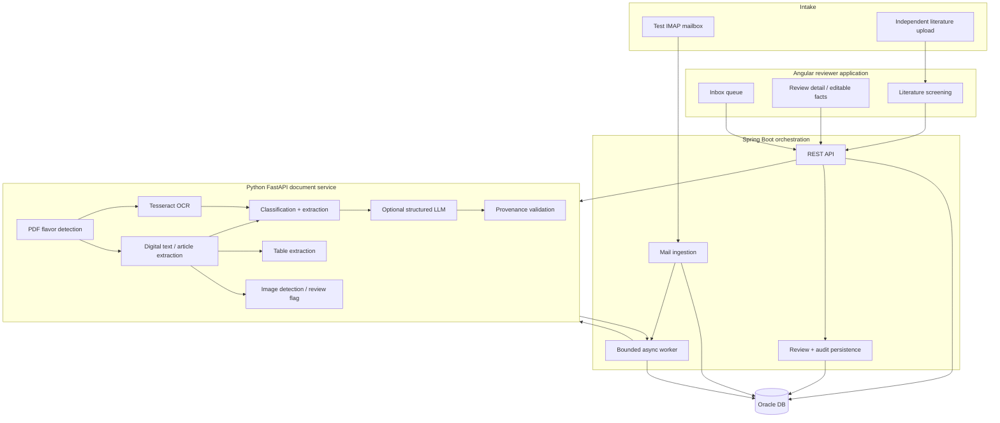
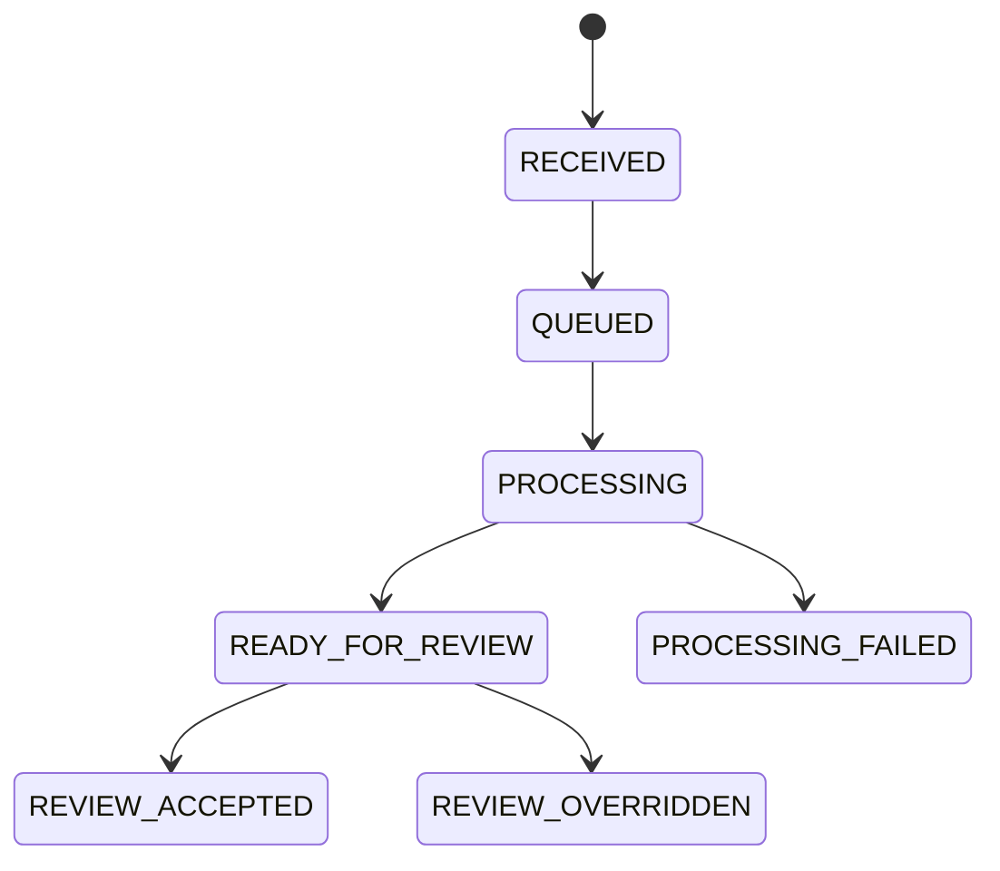

# Architecture

## Objective

Automate the first-pass review of incoming healthcare safety mailbox messages while keeping a human reviewer in control. Each message can receive one or more labels: ICSR, PQC, MI, or Not Relevant. Structured facts carry confidence and source provenance down to email/PDF page.

## Runtime architecture



## Component responsibilities

### Angular

- Inbox review queue.
- Classification confidence/reasons.
- Attachment flavor, language, OCR confidence and processing time.
- Editable extracted facts.
- Source-page/evidence display.
- Accept/override review actions.
- Timestamped audit history.
- Independent literature batch uploader and per-case results.

### Spring Boot

- IMAP/IMAPS mailbox polling.
- Message-ID de-duplication.
- MIME body/attachment parsing.
- REST API and validation.
- Bounded asynchronous document orchestration.
- AI-service multipart calls.
- Oracle persistence.
- Reviewer action / override persistence.
- Input-size limits and optional mutation API-key guard.
- Actuator health/metrics and graceful shutdown.

### Python FastAPI

- PDF flavor detection: digital, scanned/handwritten, published article, non-English.
- Direct text extraction and OCR fallback.
- Language detection.
- Table extraction into structured rows.
- Embedded-image review flags.
- 10-sentence reviewer summary.
- Multi-label ICSR/PQC/MI/Not Relevant classification.
- Conservative structured extraction with `Not stated` for gaps.
- Optional structured-LLM path.
- Validation of LLM field provenance against actual source content.
- Literature case splitting and case-level screening.

### Oracle

Queryable storage for messages, attachment metadata, classifications, extracted facts, reviewer actions and audit events. Flyway owns the application migration lifecycle.

## Provenance contract

A supported extracted field contains:

```json
{
  "value": "45",
  "confidence": 0.97,
  "source": {
    "source_type": "PDF",
    "source_name": "safety-report-01.pdf",
    "page": 2,
    "evidence": "...45-year-old patient..."
  }
}
```

If the source does not state the field, the value is `Not stated`, confidence is `0.0`, and source is `null`.

## Processing states



The current candidate implementation uses a bounded in-process executor so mail polling is not blocked by OCR/AI latency. Production evolution should replace this with durable job semantics so a process restart cannot lose queued work.

## AI decision strategy

The AI layer has two modes.

1. **Deterministic fallback** for offline/local/CI repeatability. It applies the assignment's four-element ICSR rule, negation-aware safety terms and conservative extraction.
2. **Structured LLM mode** for richer understanding. The service sends a strict extraction contract, validates returned JSON with Pydantic and then validates claimed page/evidence provenance against the actual input. A field with unsupported evidence is discarded rather than accepted.

This separation gives predictable automated tests without pretending deterministic regexes are sufficient for a production pharmacovigilance system.

## Security boundaries

- Secrets are externalized through environment variables.
- The repository and generated corpus contain synthetic data only.
- Upload/body sizes are bounded.
- Mutation endpoints can require a constant-time API-key check.
- Container workloads run with reduced privileges where practical.
- Cloud LLM use is opt-in.

Production must add enterprise identity (OIDC/OAuth2), RBAC, TLS/mTLS, secret vault integration, malware scanning, encryption/key management, audit export to SIEM, approved model/provider controls and retention policies.

## Production evolution

The highest-value production changes are:

1. Durable queue with retry, backoff, idempotency and dead-letter handling.
2. Immutable encrypted original-document storage with lifecycle/retention policy.
3. OIDC/OAuth2 identity and reviewer/admin roles.
4. Centralized secrets and certificate management.
5. Distributed tracing, structured logs, metrics, dashboards and alerts.
6. Malware scanning and file-content validation before document parsing.
7. Approved cloud-model gateway or private model hosting with regional/data-retention controls.
8. Evaluation harness with labeled domain data, drift monitoring and reviewer-agreement metrics.
9. High-availability Oracle deployment, backup/restore testing and disaster recovery.
10. Formal validation package appropriate for regulated GxP / pharmacovigilance usage.
