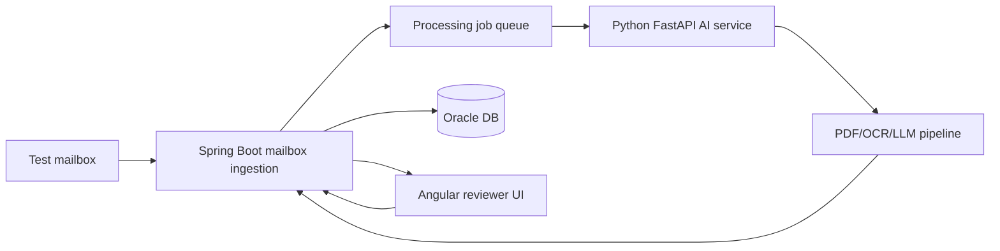

# Architecture

## Goal

Automate the first-pass review of incoming healthcare safety mailbox messages while keeping a human reviewer in control. The application classifies each message into one or more of ICSR, PQC, MI, or Not Relevant; extracts structured facts; records confidence; and preserves source provenance down to email/PDF page.

## System flow

## Responsibilities

### Angular
- Review queue with classification, confidence, and summaries.
- Item detail view with editable extracted facts.
- Accept/override actions.
- Source provenance display for every extracted value.

### Spring Boot
- Test-mailbox ingestion.
- REST API and orchestration.
- Asynchronous processing queue.
- Calls the Python AI service.
- Persists messages, attachments, AI results, reviewer actions, and audit events.

### Python AI service
- Detect PDF flavor: digital, scanned/handwritten, published article, or non-English.
- Extract text/tables and image descriptions.
- OCR/vision hook for scanned content.
- Structured multi-label classification and extraction.
- Return confidence plus source page/provenance.
- Never invent missing values; use `Not stated`/`unknown`.

### Oracle
- Queryable store for messages, attachments, processing jobs, classifications, extracted facts, and audit history.

## Queue strategy

The prototype uses a bounded in-process executor in Spring Boot. Mail intake creates a processing job and returns quickly. A worker invokes the AI service and persists results. Production would move this to a durable queue such as Kafka/SQS/RabbitMQ with idempotency keys and retry/dead-letter policies.

## Data handling

Only synthetic data is permitted in development and demonstration. Secrets are supplied through environment variables and must never be committed. If a cloud model is enabled, the README/write-up must call out the data-retention and residency trade-offs.

## Provenance contract

Every extracted field stores:
- source type (`EMAIL` or `PDF`)
- source identifier/file name
- PDF page number when applicable
- evidence text/snippet where safe
- field-level confidence

This provenance is treated as part of the domain model, not UI-only metadata.
